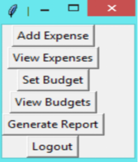
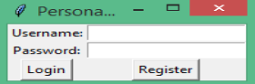
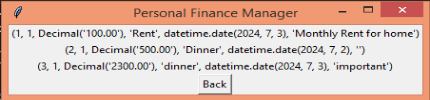
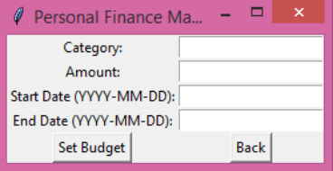

# 💰 Personal Finance Manager  

A **Python-based desktop application** with **Tkinter GUI** and **MySQL database** to help users manage their personal finances efficiently.  
It provides expense tracking, budget management, financial reporting, and secure authentication – all in one tool.  

  

---

## 🚀 Features  

- ✅ **User Authentication** (Register/Login with SHA-256 password hashing)  
- ✅ **Expense Tracking** – Add, view, and categorize expenses  
- ✅ **Budget Management** – Set budgets for categories and compare with actual spending  
- ✅ **Financial Reporting** – Generate insights and summaries (category-wise totals)  
- ✅ **User-Friendly Interface** – Simple Tkinter GUI for smooth navigation  

---

## 📸 Screenshots  

### 1. Login & Registration  
  

### 2. Expense Tracking  
  

### 3. Budget Management  
  

### 4. Reports  
  

### 5. Main Dashboard  
  

---

## 🏗️ Project Structure  

```
Personal-Finance-Manager/
│── main.py              # Entry point
│── gui.py               # Tkinter GUI
│── db.py                # Database connection & table creation
│── user.py              # User registration & login
│── expense.py           # Expense handling
│── budget.py            # Budget handling
│── report.py            # Reports & summaries
│── your_database.sql    # SQL schema & sample data
│── README.md            # Project documentation
│── screenshots/         # Screenshots folder
```

---

## ⚙️ Tech Stack  

| Component      | Technology |
|----------------|------------|
| Language       | Python 3   |
| GUI Toolkit    | Tkinter    |
| Database       | MySQL      |
| Libraries      | mysql-connector-python, hashlib |
| Version Control| Git & GitHub |

---

## 💡 Objectives  

- 📊 Track and categorize daily expenses  
- 💵 Set budgets and monitor spending  
- 📈 Generate financial insights & reports  
- 🔐 Secure authentication for data privacy  
- 🖥️ Intuitive user interface  

---

## 🛠️ Hardware & Software Requirements  

**Hardware:**  
- Processor: 1 GHz or faster  
- RAM: 2 GB or more  
- Disk Space: 500 MB  

**Software:**  
- Python 3.7+  
- MySQL Server  
- Required Libraries (`pip install -r requirements.txt`)  
- Tkinter (comes with Python)  
- IDE (VS Code, PyCharm, etc.)  

---

## 🔮 Future Enhancements  

- 📊 Graphical reports (Pie/Bar charts using Matplotlib/Seaborn)  
- 📱 Mobile version (Kivy/Flutter-Python bridge)  
- 🏦 Bank API integration for auto-expense logging  
- 📑 Export reports to PDF/Excel  

---

## 📂 Demo  

Clone and run locally:  

```bash
git clone https://github.com/RajanSita/Personal-Finance-Maneger.git
cd Personal-Finance-Maneger
pip install -r requirements.txt
python main.py
```

---

## 📜 License

This project is licensed under the MIT License.

---

## ✍️ Author

👤 **Rajan Sita**

* GitHub: [RajanSita](https://github.com/RajanSita)
